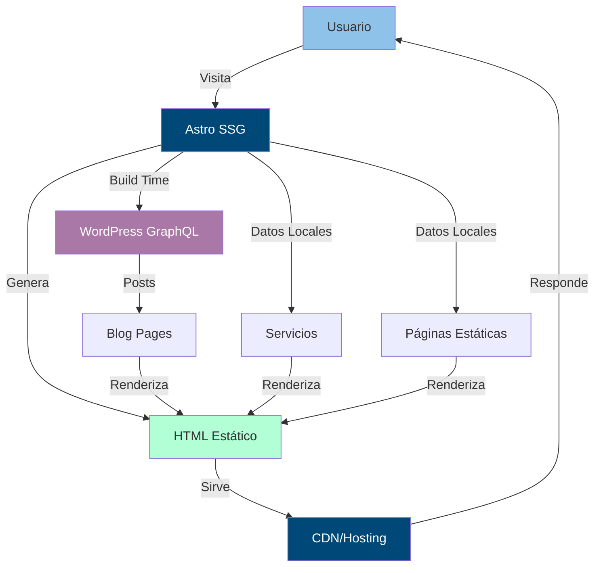

# Arquitectura del Proyecto - S I Castro Consultores

## 📋 Resumen Ejecutivo

Sitio web corporativo para despacho contable mexicano, construido con Astro 5.x, Tailwind CSS y consumiendo contenido de blog desde WordPress vía WPGraphQL.

**Stack Tecnológico Principal:**
- Framework: Astro 5.x (SSG)
- Estilos: Tailwind CSS 3.x
- CMS: WordPress con WPGraphQL
- Cliente GraphQL: graphql-request
- TypeScript para tipado estático

---

## 🎨 Sistema de Diseño

### Paleta de Colores

```css
/* Colores Principales */
--indigo-dye: #004878        /* Color primario - CTA, enlaces, encabezados */
--light-sky-blue: #8fc2e9    /* Color secundario - acentos, hovers */
--aquamarine: #b2ffd6        /* Color de éxito - badges, estados positivos */
--african-violet: #aa78a6    /* Color de acento - destacados, iconos */
--raisin-black: #2e282a      /* Color de texto principal */
--background: #f6f7fb        /* Color de fondo principal */
```

### Tipografía

**Encabezados (H1-H6):**
- Familia: `Libre Caslon Display` (Google Fonts)
- Peso: 400 (Regular)
- Uso: Títulos principales, encabezados de sección

**Cuerpo de Texto:**
- Familia: `Quicksand` (Google Fonts)
- Pesos: 300, 400, 500, 600, 700
- Uso: Párrafos, botones, navegación, formularios

### Jerarquía de Tamaños
```
H1: text-5xl lg:text-6xl (48px/60px desktop)
H2: text-4xl lg:text-5xl (36px/48px desktop)
H3: text-3xl lg:text-4xl (30px/36px desktop)
H4: text-2xl lg:text-3xl (24px/30px desktop)
Body: text-base lg:text-lg (16px/18px desktop)
Small: text-sm (14px)
```

---

## 📁 Estructura de Carpetas

```
sicastro/
├── src/
│   ├── components/          # Componentes reutilizables
│   │   ├── ui/             # Componentes básicos de UI
│   │   │   ├── Button.astro
│   │   │   ├── Card.astro
│   │   │   ├── Container.astro
│   │   │   ├── Section.astro
│   │   │   └── Badge.astro
│   │   ├── layout/         # Componentes de layout
│   │   │   ├── Header.astro
│   │   │   ├── Footer.astro
│   │   │   ├── Navigation.astro
│   │   │   └── MobileMenu.astro
│   │   ├── home/           # Componentes específicos del home
│   │   │   ├── Hero.astro
│   │   │   ├── Services.astro
│   │   │   ├── Stats.astro
│   │   │   ├── Testimonials.astro
│   │   │   ├── CTA.astro
│   │   │   └── FAQ.astro
│   │   ├── services/       # Componentes de servicios
│   │   │   ├── ServiceCard.astro
│   │   │   └── ServiceDetail.astro
│   │   ├── blog/           # Componentes de blog
│   │   │   ├── BlogCard.astro
│   │   │   ├── BlogPost.astro
│   │   │   └── BlogSidebar.astro
│   │   └── forms/          # Formularios
│   │       ├── ContactForm.astro
│   │       └── NewsletterForm.astro
│   ├── layouts/            # Layouts de página
│   │   ├── BaseLayout.astro
│   │   ├── PageLayout.astro
│   │   └── BlogLayout.astro
│   ├── pages/              # Rutas del sitio
│   │   ├── index.astro                    # /
│   │   ├── servicios.astro                # /servicios
│   │   ├── servicio/                      # /servicio/[id]
│   │   │   └── [id].astro
│   │   ├── sobre-nosotros.astro           # /sobre-nosotros
│   │   ├── blog/                          # /blog
│   │   │   ├── index.astro
│   │   │   └── [slug].astro               # /blog/[slug]
│   │   ├── contacto.astro                 # /contacto
│   │   ├── newsletter.astro               # /newsletter
│   │   ├── informacion-legal.astro        # /informacion-legal
│   │   └── aviso-privacidad.astro         # /aviso-privacidad
│   ├── lib/                # Utilidades y lógica de negocio
│   │   ├── wordpress/      # Cliente WordPress
│   │   │   ├── client.ts   # Cliente GraphQL
│   │   │   ├── queries.ts  # Queries GraphQL
│   │   │   └── types.ts    # Tipos TypeScript
│   │   ├── services.ts     # Datos de servicios
│   │   └── utils.ts        # Funciones auxiliares
│   ├── types/              # Definiciones de tipos globales
│   │   └── index.ts
│   └── styles/             # Estilos globales
│       └── global.css      # Estilos base y custom
├── public/                 # Archivos estáticos
│   ├── images/            # Imágenes
│   ├── icons/             # Iconos SVG
│   └── favicon.svg
├── astro.config.mjs       # Configuración de Astro
├── tailwind.config.mjs    # Configuración de Tailwind
└── tsconfig.json          # Configuración de TypeScript
```

---

## 🏗️ Arquitectura de Componentes

### Sistema de Componentes Atómicos

**Átomos (UI básicos):**
- `Button.astro`: Botones con variantes (primary, secondary, outline)
- `Badge.astro`: Insignias para categorías o estados
- `Container.astro`: Contenedor con max-width responsive
- `Section.astro`: Sección con espaciado consistente

**Moléculas (Componentes compuestos):**
- `Card.astro`: Tarjeta genérica con imagen, título y descripción
- `ServiceCard.astro`: Tarjeta específica para servicios
- `BlogCard.astro`: Tarjeta de preview de post
- `TestimonialCard.astro`: Tarjeta de testimonio

**Organismos (Secciones complejas):**
- `Header.astro`: Navegación principal
- `Footer.astro`: Pie de página con links y contacto
- `Hero.astro`: Sección hero del home
- `Services.astro`: Grid de servicios
- `FAQ.astro`: Sección de preguntas frecuentes

**Templates (Layouts):**
- `BaseLayout.astro`: Layout base con HTML, head, body
- `PageLayout.astro`: Layout para páginas de contenido
- `BlogLayout.astro`: Layout específico para posts de blog

---

## 📄 Páginas y Estructura de Contenido

### 1. Página de Inicio (/)

**Secciones en orden:**
1. **Hero** - Mensaje principal + CTA
   - Título impactante
   - Subtítulo con propuesta de valor
   - Botón CTA principal
   - Imagen/ilustración profesional

2. **Estadísticas** - KPIs de la empresa
   - Años de experiencia
   - Clientes satisfechos
   - Casos de éxito
   - Tasa de cumplimiento

3. **Servicios Destacados** - Top 4 servicios
   - Cards con iconos
   - Título y descripción breve
   - Link a detalle

4. **Sobre Nosotros (Preview)** - Brief institucional
   - Misión/visión
   - Diferenciadores
   - CTA a página completa

5. **Testimoniales** - Opiniones de clientes
   - Carrusel de testimonios
   - Foto, nombre, empresa
   - Calificación

6. **Blog Preview** - Últimos 3 posts
   - Cards de blog
   - Fecha, categoría, título
   - Link a blog completo

7. **FAQ** - Preguntas frecuentes
   - Accordion interactivo
   - 5-7 preguntas clave

8. **CTA Newsletter** - Captura de emails
   - Form simple
   - Beneficios de suscribirse

### 2. Página de Servicios (/servicios)

**Estructura:**
- Hero con título y descripción general
- Grid responsive de servicios (3 columnas desktop, 1 móvil)
- Cada card enlaza a `/servicio/[id]`

**Servicios incluidos:**
1. Asesoría Fiscal
2. Contabilidad General
3. Auditoría
4. Consultoría Financiera
5. Nómina y IMSS
6. Planeación Fiscal
7. Constitución de Empresas
8. Representación Legal Fiscal

### 3. Detalle de Servicio (/servicio/[id])

**Contenido dinámico:**
- Título del servicio
- Descripción extendida
- Beneficios (lista con bullets)
- Proceso de trabajo (pasos numerados)
- Precio/forma de cotizar
- CTA de contacto
- Servicios relacionados

### 4. Sobre Nosotros (/sobre-nosotros)

**Secciones:**
- Historia de la empresa
- Misión y visión
- Valores corporativos
- KPIs y logros
- Equipo (fotos y perfiles)
- Certificaciones/reconocimientos
- CTA de contacto

### 5. Blog (/blog)

**Features:**
- Grid de posts (2-3 columnas)
- Paginación
- Filtro por categorías
- Búsqueda (opcional)
- Sidebar con:
  - Posts populares
  - Categorías
  - Newsletter signup

### 6. Post Individual (/blog/[slug])

**Estructura:**
- Imagen destacada
- Título y metadatos (fecha, autor, categoría)
- Contenido del post (HTML desde WordPress)
- Sidebar con related posts
- CTA de contacto o newsletter
- Comentarios (opcional)

### 7. Contacto (/contacto)

**Elementos:**
- Formulario de contacto
  - Nombre
  - Email
  - Teléfono
  - Servicio de interés (select)
  - Mensaje
- Información de contacto
  - Dirección física
  - Teléfono(s)
  - Email
  - Horarios
- Mapa de ubicación (Google Maps embed)

### 8. Newsletter (/newsletter)

**Contenido:**
- Explicación de beneficios
- Formulario de suscripción
- Ejemplos de contenido
- Política de privacidad

### 9. Páginas Legales

**Información Legal (/informacion-legal):**
- Términos y condiciones
- Política de uso
- Avisos legales

**Aviso de Privacidad (/aviso-privacidad):**
- Cumplimiento LFPDPPP (Ley mexicana)
- Uso de datos personales
- Derechos ARCO
- Contacto para privacidad

---

## 🔌 Integración con WordPress

### Configuración de WordPress

**Plugins Requeridos:**
1. **WPGraphQL** (principal)
2. **WPGraphQL for Advanced Custom Fields** (si se usan ACFs)
3. **Yoast SEO** (para meta tags)

**Endpoint GraphQL:**
```
https://blog.sicastro.com/graphql
```

### Configuración del Cliente GraphQL

**Dependencias:**
```json
{
  "graphql": "^16.8.1",
  "graphql-request": "^6.1.0"
}
```

**Cliente (`src/lib/wordpress/client.ts`):**
```typescript
import { GraphQLClient } from 'graphql-request';

const endpoint = import.meta.env.WORDPRESS_GRAPHQL_URL || 
                 'https://blog.sicastro.com/graphql';

export const graphqlClient = new GraphQLClient(endpoint, {
  headers: {
    'Content-Type': 'application/json',
  },
});
```

### Queries GraphQL

**Listar Posts:**
```graphql
query GetPosts($first: Int = 10) {
  posts(first: $first, where: { status: PUBLISH }) {
    nodes {
      id
      title
      slug
      date
      excerpt
      featuredImage {
        node {
          sourceUrl
          altText
        }
      }
      categories {
        nodes {
          name
          slug
        }
      }
      author {
        node {
          name
          avatar {
            url
          }
        }
      }
    }
  }
}
```

**Post Individual:**
```graphql
query GetPost($slug: String!) {
  postBy(slug: $slug) {
    id
    title
    content
    date
    excerpt
    featuredImage {
      node {
        sourceUrl
        altText
      }
    }
    categories {
      nodes {
        name
        slug
      }
    }
    author {
      node {
        name
        avatar {
          url
        }
      }
    }
    seo {
      title
      metaDesc
    }
  }
}
```

### Tipos TypeScript

```typescript
export interface WordPressPost {
  id: string;
  title: string;
  slug: string;
  date: string;
  excerpt: string;
  content: string;
  featuredImage?: {
    node: {
      sourceUrl: string;
      altText: string;
    };
  };
  categories: {
    nodes: Array<{
      name: string;
      slug: string;
    }>;
  };
  author: {
    node: {
      name: string;
      avatar: {
        url: string;
      };
    };
  };
  seo?: {
    title: string;
    metaDesc: string;
  };
}
```

### Fetching de Datos en Astro

```typescript
// En página de blog
---
import { graphqlClient } from '@/lib/wordpress/client';
import { GET_POSTS } from '@/lib/wordpress/queries';
import type { WordPressPost } from '@/lib/wordpress/types';

const { posts } = await graphqlClient.request(GET_POSTS, { first: 10 });
---
```

---

## 🎨 Configuración de Tailwind

**tailwind.config.mjs:**
```javascript
/** @type {import('tailwindcss').Config} */
export default {
  content: ['./src/**/*.{astro,html,js,jsx,md,mdx,svelte,ts,tsx,vue}'],
  theme: {
    extend: {
      colors: {
        primary: {
          DEFAULT: '#004878',
          light: '#8fc2e9',
          dark: '#003256',
        },
        secondary: {
          DEFAULT: '#aa78a6',
          light: '#d4b3d1',
        },
        accent: {
          DEFAULT: '#b2ffd6',
          dark: '#8ce6b8',
        },
        dark: {
          DEFAULT: '#2e282a',
          light: '#4a4244',
        },
        background: '#f6f7fb',
      },
      fontFamily: {
        heading: ['Libre Caslon Display', 'serif'],
        body: ['Quicksand', 'sans-serif'],
      },
      animation: {
        'fade-in': 'fadeIn 0.5s ease-in-out',
        'slide-up': 'slideUp 0.6s ease-out',
        'slide-in': 'slideIn 0.5s ease-out',
      },
      keyframes: {
        fadeIn: {
          '0%': { opacity: '0' },
          '100%': { opacity: '1' },
        },
        slideUp: {
          '0%': { transform: 'translateY(20px)', opacity: '0' },
          '100%': { transform: 'translateY(0)', opacity: '1' },
        },
        slideIn: {
          '0%': { transform: 'translateX(-20px)', opacity: '0' },
          '100%': { transform: 'translateX(0)', opacity: '1' },
        },
      },
    },
  },
  plugins: [
    require('@tailwindcss/typography'),
    require('@tailwindcss/forms'),
  ],
}
```

---

## 🚀 Optimizaciones y Mejores Prácticas

### Performance

1. **Imágenes:**
   - Usar `<Image>` component de Astro
   - Lazy loading automático
   - Formatos modernos (WebP, AVIF)
   - Responsive images con srcset

2. **CSS:**
   - Critical CSS inline en head
   - Purge automático con Tailwind
   - Minificación en producción

3. **JavaScript:**
   - Islands Architecture de Astro
   - Hidratación parcial
   - Code splitting automático

### SEO

1. **Meta Tags:**
   - Título único por página
   - Meta description
   - Open Graph tags
   - Twitter Cards
   - Schema.org markup

2. **Sitemap:**
   - Generación automática con Astro
   - Inclusión de posts de WordPress

3. **Robots.txt:**
   - Configuración para crawlers
   - Exclusión de páginas admin

### Accesibilidad

- Semántica HTML5 correcta
- ARIA labels donde sea necesario
- Contraste de colores WCAG AA
- Navegación por teclado
- Focus indicators visibles
- Alt text en imágenes

---

## 📱 Diseño Responsive

### Breakpoints de Tailwind
```
sm: 640px   (móvil grande)
md: 768px   (tablet)
lg: 1024px  (desktop pequeño)
xl: 1280px  (desktop)
2xl: 1536px (desktop grande)
```

### Enfoque Mobile-First

Todos los componentes se diseñan primero para móvil:
```astro
<div class="flex flex-col md:flex-row lg:gap-8">
  <!-- Columna en móvil, fila en tablet+ -->
</div>
```

---

## 🔐 Variables de Entorno

**`.env` (desarrollo):**
```env
WORDPRESS_GRAPHQL_URL=http://localhost/wordpress/graphql
SITE_URL=http://localhost:4321
CONTACT_EMAIL=contacto@sicastro.com
```

**`.env.production` (producción):**
```env
WORDPRESS_GRAPHQL_URL=https://blog.sicastro.com/graphql
SITE_URL=https://sicastro.com
CONTACT_EMAIL=contacto@sicastro.com
```

---

## 📦 Dependencias del Proyecto

### Principales
```json
{
  "dependencies": {
    "astro": "^5.14.1",
    "@astrojs/tailwind": "^5.x",
    "tailwindcss": "^3.4.0",
    "graphql": "^16.8.1",
    "graphql-request": "^6.1.0"
  },
  "devDependencies": {
    "@tailwindcss/typography": "^0.5.10",
    "@tailwindcss/forms": "^0.5.7",
    "typescript": "^5.3.3"
  }
}
```

---

## 🗺️ Diagrama de Arquitectura



---

## 📝 Guía de Configuración de WordPress

### Paso 1: Instalar WordPress
1. Descargar WordPress desde wordpress.org
2. Configurar base de datos MySQL
3. Completar instalación en dominio/subdirectorio

### Paso 2: Instalar WPGraphQL
1. Ir a Plugins > Añadir nuevo
2. Buscar "WPGraphQL"
3. Instalar y activar
4. Verificar endpoint: `tu-sitio.com/graphql`

### Paso 3: Configurar WPGraphQL
1. Ir a GraphQL > Settings
2. Habilitar "Public Introspection"
3. Configurar CORS si es necesario
4. Guardar cambios

### Paso 4: Crear Estructura de Blog
1. Crear categorías relevantes:
   - Noticias Fiscales
   - Tips Contables
   - Actualizaciones Legales
   - Guías Prácticas

2. Configurar campos personalizados (opcional):
   - Tiempo de lectura
   - Nivel de dificultad
   - Recursos descargables

### Paso 5: Crear Posts de Prueba
1. Crear 3-5 posts con contenido real
2. Asignar categorías
3. Agregar imágenes destacadas
4. Publicar

### Paso 6: Probar Queries
1. Ir a GraphQL IDE en wp-admin
2. Ejecutar query de prueba:
```graphql
{
  posts {
    nodes {
      title
      slug
    }
  }
}
```

---

## 🎯 Próximos Pasos de Implementación

1. **Fase 1: Setup y Configuración** (Días 1-2)
   - Instalar Tailwind CSS
   - Configurar fuentes
   - Crear estructura de carpetas
   - Setup de tipos TypeScript

2. **Fase 2: Sistema de Diseño** (Días 3-4)
   - Componentes UI base
   - Layout principal (Header/Footer)
   - Sistema de colores y tipografía

3. **Fase 3: Páginas Estáticas** (Días 5-8)
   - Homepage con todas las secciones
   - Página de servicios
   - Sobre nosotros
   - Contacto y newsletter
   - Páginas legales

4. **Fase 4: Integración WordPress** (Días 9-11)
   - Configurar WordPress + WPGraphQL
   - Cliente GraphQL en Astro
   - Páginas de blog dinámicas
   - Testing de integración

5. **Fase 5: Optimización y Deploy** (Días 12-14)
   - Performance optimization
   - SEO implementation
   - Testing responsive
   - Deployment a producción

---

## 📚 Recursos y Referencias

- [Documentación de Astro](https://docs.astro.build)
- [Tailwind CSS](https://tailwindcss.com/docs)
- [WPGraphQL Docs](https://www.wpgraphql.com/docs)
- [graphql-request](https://github.com/jasonkuhrt/graphql-request)
- [Google Fonts](https://fonts.google.com)

---

**Última actualización:** 2025-10-04  
**Versión:** 1.0  
**Autor:** Arquitectura inicial para S I Castro Consultores